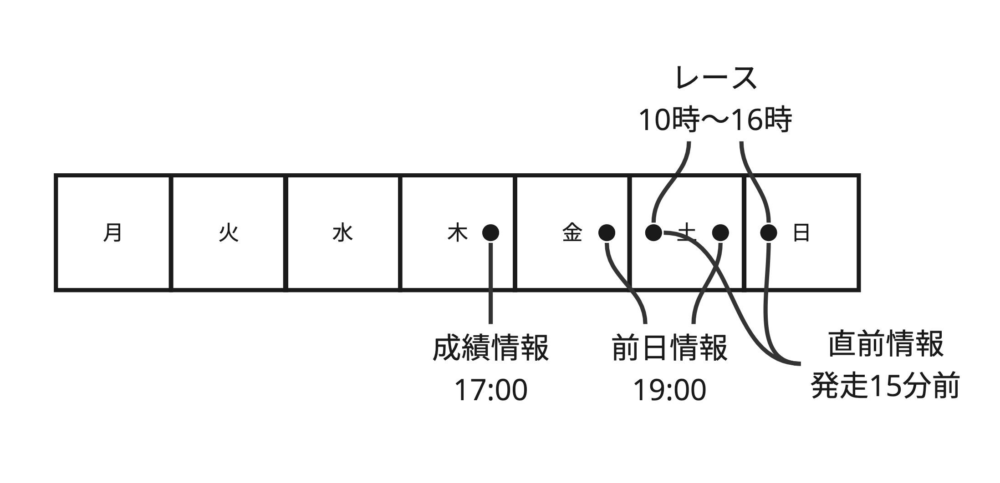

# JRDBDataParsingTools

- [JRDBデータのご案内](http://www.jrdb.com/program/data.html)
- [ＪＲＤＢデータの種類と概要](http://www.jrdb.com/program/jrdb_data_doc.txt)
- [JRDBデータコード表](http://www.jrdb.com/program/jrdb_code.txt)
- [Data Index (restricted)](http://www.jrdb.com/member/dataindex.html)
- [馬券の種類：はじめての方へ](https://www.jra.go.jp/kouza/beginner/baken/)
- [PostgreSQL JDBC driver](https://jdbc.postgresql.org/download/)
- [dbt - How we structure our dbt projects](https://docs.getdbt.com/best-practices/how-we-structure/1-guide-overview)
- [競走馬データ仕様書内容の説明](http://www.jrdb.com/program/Kyi/ky_siyo_doc.txt)
- [JRA レーシングカレンダー](https://www.jra.go.jp/keiba/calendar/)
- [JMAダウンロードファイル(CSVファイル)の形式](https://www.data.jma.go.jp/risk/obsdl/top/help3.html)
- [JMA、今の天候情報例](https://tenki.jp/forecast/3/15/4510/12204/1hour.html)

### Table grain

| file |                                                                                                           | grain          | ユニークキー                             | 更新時間   | 実績/予測 |
| ---- | --------------------------------------------------------------------------------------------------------- | -------------- | ---------------------------------------- | ---------- | --------- |
| SED  | 成績分析用                                                                                                | 1 race + horse | レースキー・馬番・競走成績キー           | 木 17:00   | 成績情報  |
| SKB  | 成績分析用・拡張データ                                                                                    | 1 race + horse | レースキー・馬番・競走成績キー           | 木 17:00   | 成績情報  |
| BAC  | レース番組情報                                                                                            | 1 race         | レースキー                               | 金土	19:00 | 前日情報  |
| CYB  | 調教分析データ                                                                                            | 1 race + horse | レースキー・馬番                         | 金土	19:00 | 前日情報  |
| CHA  | 調教本追切データ                                                                                          | 1 race + horse | レースキー・馬番                         | 金土	19:00 | 前日情報  |
| KAB  | 馬場・天候予想等の開催に対するデータ                                                                      | 1 place/day    | 開催キー + 年月日 (*1)                   | 金土	19:00 | 前日情報  |
| KYI  | 競走馬ごとのデータ。IDM、各指数を格納、放牧先を追加                                                       | 1 race + horse | レースキー・馬番・血統登録番号           | 金土	19:00 | 前日情報  |
| OZ   | 単複・馬連の基準オッズデータ                                                                              | 1 race         | レースキー                               | 金土	19:00 | 前日情報  |
| OW   | ワイドの基準オッズデータ                                                                                  | 1 race         | レースキー                               | 金土	19:00 | 前日情報  |
| OU   | 馬単の基準オッズデータ                                                                                    | 1 race         | レースキー                               | 金土	19:00 | 前日情報  |
| OT   | ３連複の基準オッズデータ                                                                                  | 1 race         | レースキー                               | 金土	19:00 | 前日情報  |
| OV   | ３連単の基準オッズデータ                                                                                  | 1 race         | レースキー                               | 金土	19:00 | 前日情報  |
| UKC  | 馬に関するデータを格納                                                                                    | 1 horse        | 血統登録番号 + データ年月日 (SCD Type 2) | 金土	19:00 | 前日情報  |
| TYB  | 直前情報データ                                                                                            | 1 race + horse | レースキー・馬番                         | (*2)       | 当日情報  |
| HJC  | 払戻(実績)情報に関するデータを格納 (payout information, i.e. which horse won how much for what 馬券 type) | 1 race         | レースキー                               | 土日 17:00 | 当日情報  |

Notes:
1. 同じ開催キーのレースは基本的に同じ日に行われるが、天気によって二日後など延期されることが稀にある（例: 2011年1小倉7）。そのため、開催キー＋年月日が本当のキーとなる。
2. 1) 直前データ／直前累積データの場合 競馬開催日 各レース出走１５分前頃。仕様書では、15分前となっていますが、10分前になってしまうこともあります。（コロナ渦以降の運用体制のため）(verified, sometimes it just comes in late, but its there beforehand. Must download from bottom of race day tab in http://www.jrdb.com/member/n_index.html) 2) 直前累積データ最終版の場合 競馬開催日 全レース終了後、午後５：００頃

| キー         | 構成                                                                 |
| ------------ | -------------------------------------------------------------------- |
| レースキー   | 「場コード・年・回・日・Ｒ」の組み合わせ                             |
| 馬番         | 1-16など                                                             |
| 血統登録番号 | 99101712　など                                                       |
| 開催キー     | 「場コード・年・回・日」の組み合わせ。レースキーの一部とリンク可能。 |

Todo: Especially in KYI, you're seeing a lot of rows with keys that don't exist in the codes. Could this be because you're using the 年パック instead of individual files? Test this hypothesis. => Answer: KYI is the same 年パック as well as per-date files.

| Dataset | Verified range | Has duplicates? | Notes                                                  |
| ------- | -------------- | --------------- | ------------------------------------------------------ |
| bac     | ~2023/12/17    | [x]             |                                                        |
| cha     | ~2023/12/17    | [ ]             |                                                        |
| cyb     | ~2023/12/17    | [x]             |                                                        |
| hjc     | ~2023/12/17    | [ ]             |                                                        |
| kab     | ~2023/12/17    | [ ]             |                                                        |
| kyi     | ~2023/12/17    | [ ]             |                                                        |
| oz      | ~2023/12/17    | [ ]             |                                                        |
| sed     | ~2023/12/17    | [x]             |                                                        |
| skb     | ~2023/12/17    | [ ]             |                                                        |
| tyb     | ~2023/12/17    | [x]             |                                                        |
| ukc     | ~2023/12/17    | [x]             | May contain duplicates in new files prior to new races |

### Todo

* Separate training features by surface, etc.. and train a separate model for each. For lag features, you can use the same lag features for all models, but you'll need to train a separate model for each surface.
* 月別平均回収率の傾向に比例する特徴量（天候など）がないか、確認する。その特徴量ごとにモデルを作成する。
* Come up with some more selection criteria for the races you bet on. Do some digging to find which races (turf, dirt, distance, etc..) your model performs best at, during which seasons, etc.. then selectively bet on only those races.
* Delete features which have extremely low importance.
* Enable your model to see which horses do well/poorly [in the winter](https://keibaman.com/need/winter/). And, what constitutes winter anyway? Probably average temperature.
* Go through the different fields and check for crazy outliers. Fix those because they will mess up the scaling.
* Your model works well for summer months. Try fine-tuning another model to work better for winter months, then combine the two models.
* Use ordinal encoding instead of categorical.
* Todo: Save the `Etag`, filename and load date alongside the `jrdb_raw` data so that you can load the data using append mode incrementally. Then select the max load date and load all files with a higher load date. This will prevent duplicates from being loaded.
* Todo: monotonic increasing id does not mean files with lower dates will have lower ids. If duplicates are in two separate files, the order in which they are processed will determine the id.
* Todo: For prediction features, each runner should have 1 possible combination of prediction features, meaning you should be able to create the features in bulk, not just race by race.
* Todo: The cases in which 異常区分 != 0 may need to be handled differently. For example, a race probably shouldn't be counted for the horse if the 異常区分 is 除外. Other 異常区分 may need different handling as well (like falling off the horse, etc.).

Metrics to track for each model:
* Payoff rate overall
* Payoff rate by surface
* Payoff rate by distance (short, medium, long)
* Payoff rate by weather
* Payoff rate by season
* Payoff rate by year
* Payoff rate by month
* Payoff rate by confidence level (if model offers confidence level)
* Payoff rate by horse age
* Payoff rate by grade
* accuracy
* precision
* recall
* f1 score
* roc auc
* confusion matrix
* feature importance
