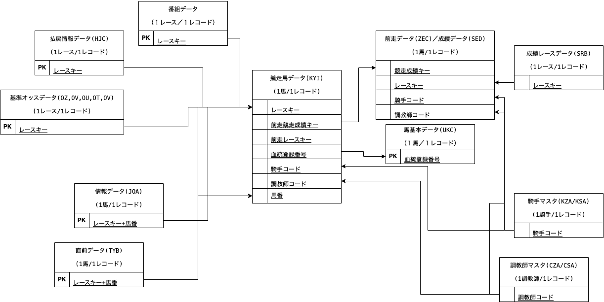

# JRDBDataParsingTools

- [JRDBデータのご案内](http://www.jrdb.com/program/data.html)
- [ＪＲＤＢデータの種類と概要](http://www.jrdb.com/program/jrdb_data_doc.txt)
- [JRDBデータコード表](http://www.jrdb.com/program/jrdb_code.txt)
- [Data Index (restricted)](http://www.jrdb.com/member/dataindex.html)
- [PostgreSQL JDBC driver](https://jdbc.postgresql.org/download/)

### Table grain

| file | grain          | keys                           | 更新時間   | 実績/予測 |
| ---- | -------------- | ------------------------------ | ---------- | --------- |
| SED  | 1 race + horse |                                | 木 17:00   | 成績情報  |
| SKB  | 1 race + horse |                                | 木 17:00   | 成績情報  |
| BAC  | 1 race         | レースキー                     | 金土	19:00 | 前日情報  |
| CHA  | 金土	19:00     | レースキー、馬番               | 金土	19:00 | 前日情報  |
| CYB  | 金土	19:00     |                                | 金土	19:00 | 前日情報  |
| KAB  | 金土	19:00     |                                | 金土	19:00 | 前日情報  |
| KYI  | 1 race + horse | レースキー、馬番、血統登録番号 | 金土	19:00 | 前日情報  |
| OT   | 1 race         | レースキー                     | 金土	19:00 | 前日情報  |
| OU   | 1 race         | レースキー                     | 金土	19:00 | 前日情報  |
| OV   | 1 race         | レースキー                     | 金土	19:00 | 前日情報  |
| OW   | 1 race         | レースキー                     | 金土	19:00 | 前日情報  |
| OZ   | 1 race         | レースキー                     | 金土	19:00 | 前日情報  |
| UKC  | 1 horse        | 血統登録番号                   | 金土	19:00 | 前日情報  |
| TYB  | 1 race + horse | レースキー、馬番               | 土日	17:00 | 当日情報  |
| HJC  | 1 race         | レースキー                     | 土日	17:00 | 当日情報  |
